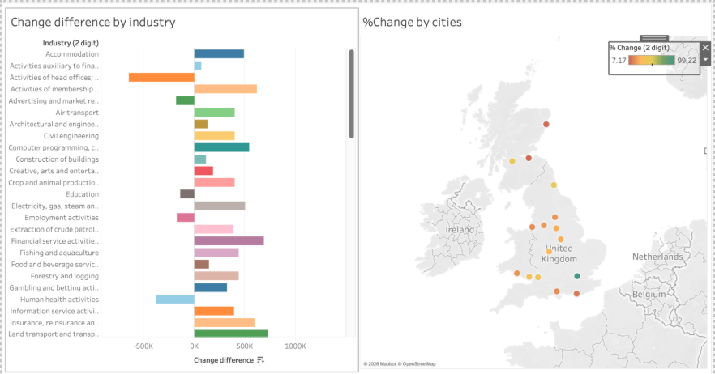
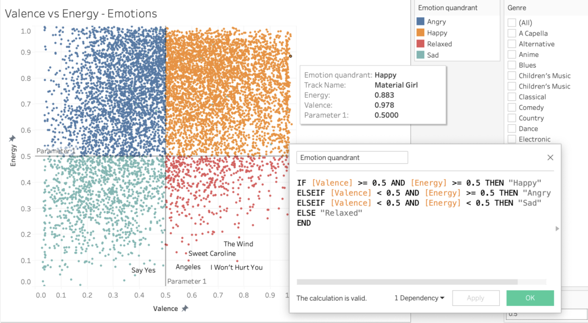
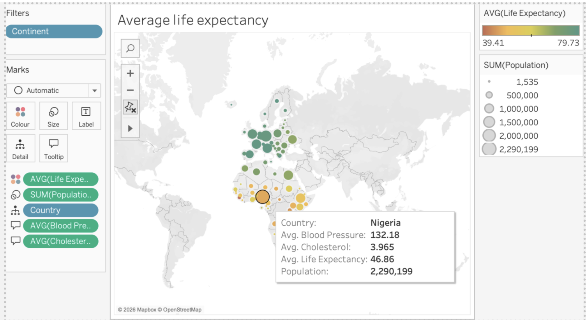

# 📊 Tableau Projects 

**Completed during Data Bootcamp**

**Author:** Swida Saeed  
**Tool:** Tableau  

---

# 🔍 Tableau Version Research

Researched and compared different Tableau versions.

## Tableau Desktop (Creator)
- Full-featured data visualisation tool  
- Connects to databases, files, and cloud sources  
- Create dashboards and advanced calculations  
- Publish locally or to Server/Cloud  

## Tableau Server
- On-premise sharing platform  
- Centralised data management  
- User permissions and access control  
- Enables collaboration  

## Tableau Public
- Free version for learning and portfolio use  
- All dashboards saved publicly  
- Limited data sources  
- No private dashboards  
- No live data refresh  
- Not suitable for confidential data  

## Tableau Reader
- Free desktop viewer  
- Allows dashboard interaction  
- Cannot edit or create reports  

## Tableau Online (Tableau Cloud)
- Cloud-hosted version of Server  
- No internal IT infrastructure required  
- Secure web-based sharing  

---

# 📊 EMSI_JobChange_UK Dashboard

Created a dashboard including:

- Bar chart showing percentage change by industry  
- UK map visualising key city locations impacted

  

### Skills Demonstrated
- Data visualisation  
- Geographic mapping  
- Dashboard layout design  
- Comparative analysis  

---

# 🎵 Spotify Data Analysis

Conducted trend analysis using the Spotify dataset.
  

### Key Findings
- Rock music tracks cluster in higher energy range  
- Rock songs show variation in valence (emotional tone)  
- Few Rock tracks appear in low-energy/high-valence range  
- Reflects genre’s energetic style  

### Skills Demonstrated
- Scatter plot analysis  
- Filtering by genre  
- Trend identification  
- Data storytelling  

---

# 🏥 Health Data Analysis

Analysed health dataset to identify trends.

  

### Key Findings
- European countries show higher life expectancy  
- Many African countries show lower life expectancy  
- Population size alone does not determine health outcomes  

### NHS Reflection
- Data can identify health inequalities  
- Supports targeted prevention strategies  
- Helps guide early intervention programmes  
- Assists resource allocation  

### Skills Demonstrated
- Heatmap visualisation  
- Geographic comparison  
- Insight interpretation  

---

# 🎯 Tableau Skills Demonstrated

- Dashboard development  
- Geographic data visualisation  
- Comparative analysis  
- Trend identification  
- Insight communication  
- Public vs enterprise tool evaluation  

---

# 📎 Full Workbook Reference

[Download Week 2 Workbook](Data_Technician_Workbook_Week_2_SwidaSaeed.pdf)
